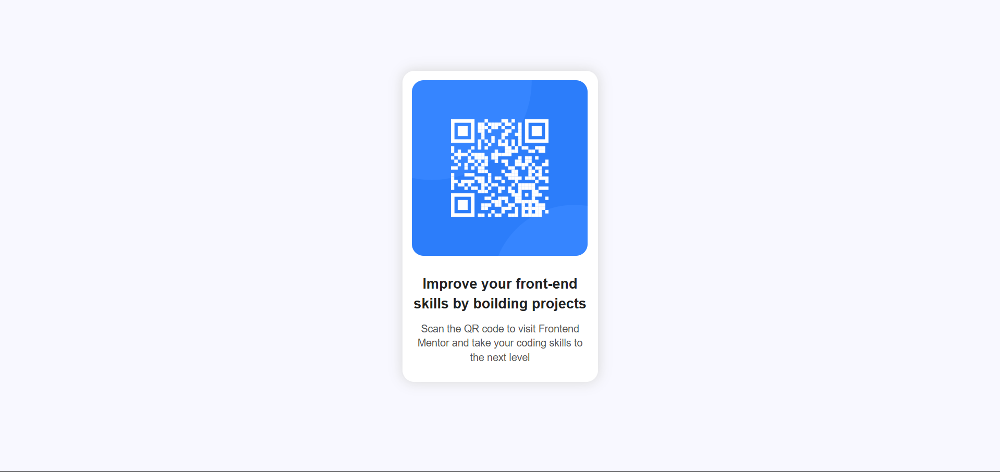

# Frontend Mentor - QR code component solution

This is a solution to the [QR code component challenge on Frontend Mentor](https://www.frontendmentor.io/challenges/qr-code-component-iux_sIO_H). Frontend Mentor challenges help you improve your coding skills by building realistic projects.

## Table of contents

- [Overview](#overview)
  - [Screenshot](#screenshot)
- [My process](#my-process)
  - [Built with](#built-with)
  - [What I learned](#what-i-learned)
  - [Continued development](#continued-development)
- [Author](#author)

**Note: Delete this note and update the table of contents based on what sections you keep.**

## Overview

I done this without struglle but I know my code isn't perfect somehow I managed to done this. I want to strugle through solving these problems because whenever I feel I'm strugling with something just one day later or just a hour later I'm feeling proud of my self because I done something was feeling hard to me.

### Screenshot

](./screenshot.jpg)

## My process

I made a div for all the elements in the HTML and I put elements in to div then I wraped my text into a info div then I wrote the CSS I put in to center with margin first i tried to use flex but grid felt easier so I used the grid box then made other things and I changed divs into semantic elements then finished

### Built with

- Semantic HTML5 markup
- CSS Grid

### What I learned

```html
figure
```

```css
.proud-of-this-css {
  box-shadow: 0 0 15px 2px #ddd;
  font-family: sans-serif;
  line-height: 1.4;
  display: grid;
  grid-template-rows: auto 1fr;
}
```

```js
const proudOfThisFunc = () => {
  console.log("🎉");
};
```

### Continued development

display-grid

## Author

- Frontend Mentor - [@BenixCat](https://www.frontendmentor.io/profile/BenixCat)
